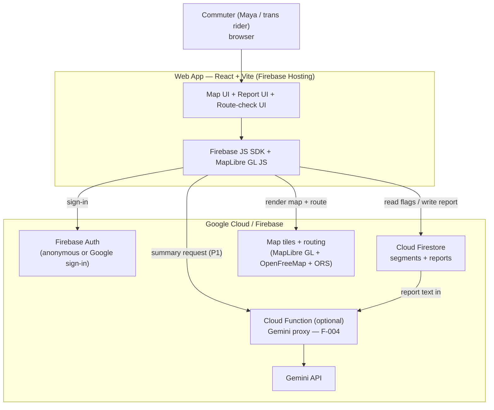

> ⚠️ PROVENANCE: Generated from idea.md while DRAFT / not freeze-eligible (no first-party or paid/committed evidence yet). Demand is UNVALIDATED. Provisional MVP scaffolding only — re-validate and regenerate after first-party interviews (post-July 2). No evidence fabricated.

# System Design Document (HLD)

> **Purpose:** the HOW, architecture. High-level. Produced by the `architect` subagent from the
> PRD. Each tech choice carries a trade-off.
> Traces back to: PRD (`docs/03-prd.md`), `idea.md`. Traces forward to: technical design, API spec, data model.
> **Build context:** 2-day SparkFest hackathon MVP. Web app + Firebase + Google Maps + Gemini.
> Scope is deliberately narrow; F-004 (Gemini summary) is P1 stretch.

## Context diagram

The system is a single-page web app served from Firebase Hosting. It talks to three external
Google surfaces: Google Maps JavaScript API (map render + route), Cloud Firestore (segment
reports), and Gemini API (P1 risk summary). All actors are commuters in the single PUP Sta. Mesa
zone (BR-003).

**Resolved (2026-07-01):** the build uses MapLibre GL JS + OpenFreeMap vector tiles (free, no API
key) for rendering, and OpenRouteService (ORS) foot-walking directions for point-to-point routing
— not Google Maps Platform as originally planned here. See "Key technology choices" below and
`docs/superpowers/specs/2026-07-01-highway-aware-routing-design.md` for the routing behavior.

## Components & responsibilities

| Component | Responsibility | Owns | Depends on |
|-----------|----------------|------|------------|
| **Web app (React + Vite)** | Renders zone map, segment flags, report form, route-check result | UI state, client validation (condition-only fields, BR-001) | Firebase JS SDK, Maps JS SDK |
| **Firebase Auth** | Authenticate reporters (BR-005) | User identity / session token | — |
| **Cloud Firestore** | Store + serve segment reports with type + timestamp (BR-004); serve seed pins | Report documents, segment metadata | Auth (via security rules) |
| **Firestore Security Rules** | Authz gate: enforce auth-to-write, condition-only schema, no crime-label fields (BR-001/005) | Access policy | Auth |
| **MapLibre GL + OpenFreeMap** | Map tiles, segment overlays (F-001) | Map render + geometry | None — OpenFreeMap is keyless |
| **OpenRouteService (ORS)** | Point-to-point routing, safety-scored to avoid flagged segments and highway-class legs where possible | Route geometry | API key (ships in client bundle; not yet referrer-restricted — open item, see Security must-dos in `AGENTS.md`) |
| **Gemini API (P1)** | Dedup + structure free-text reports into a summary; adds no facts (BR-006) | Summary text only | Report data from Firestore |
| **Cloud Function (P1, optional)** | Server-side proxy that holds the Gemini key and calls Gemini | Gemini secret + prompt | Gemini API, Firestore |

## Data flow

**UJ-001 — Pre-trip route check (F-003/F-001):**
1. App loads → Maps JS renders the Sta. Mesa zone → app reads current segment flags from Firestore.
2. User selects/enters a route through the zone.
3. App matches route to segments, computes per-segment status from flag type + freshness window (BR-004), and renders "okay" vs. "flagged tonight."
4. User decides: proceed / re-route / pay. (No SOS or dispatch anywhere — BR-002.)

**Map point-to-point routing (beyond original F-003 scope, added 2026-07-01):**
1. User sets Point A (defaults to zone center) and clicks a destination Point B on the map.
2. App fetches a route from ORS, preferring one that avoids both flagged-segment zones and
   highway-class legs ("yellow roads"); when no street-level alternative exists for one or both,
   it falls back and labels the result accordingly.
3. Route line renders green ("safe") or orange, with a badge naming the reason for caution:
   passes a flagged area, uses a major road, or both. Capped at 2 ORS calls per request — see
   `docs/superpowers/specs/2026-07-01-highway-aware-routing-design.md` for the full cascade.

**UJ-002 — One-tap segment report (F-002):**
1. User authenticates (BR-005); anonymous or Google sign-in.
2. User taps a segment → taps one condition flag {poor lighting, no crowd, recent incident} — no free-text crime label exists in the form (BR-001).
3. App writes a report doc {segmentId, conditionType, timestamp, uid} to Firestore; security rules validate auth + allowed enum.
4. Map flag updates from the live Firestore read.

**UJ-003 — Read the risk picture (F-001/F-004):**
1. User views zone map with aggregated flags.
2. (P1) App requests a structured summary; Cloud Function reads the segment's reports, prompts Gemini to deduplicate + structure only the submitted content (BR-006), returns summary text.
3. App renders the summary alongside the map. If F-004 is cut for time, UJ-003 degrades to the raw flag list — still functional.

## Segment / report data shape (high level)

> Light only — full schema is the data-model doc's (`09`) job.

- **segment**: `{ segmentId, name, geo (point or polyline) }` — seeded from idea §7's 8 provisional pins, all `[unverified]` demo content (not evidence).
- **report**: `{ reportId, segmentId, conditionType (enum: poor_lighting | no_crowd | recent_incident), createdAt (timestamp), uid, note? (optional free text, fuels F-004 only) }`.
- Derived: a segment's "tonight" status = newest report within the freshness window. **Freshness window value is `[unverified]`** — not specified in idea/PRD; needs a decision (open question carried from PRD).
- **Hard rule:** no field for neighborhood/crime classification anywhere in the schema (BR-001). Enum is closed; enforced client-side AND in security rules.

## Key technology choices + rationale

| Choice | Why | Trade-off | Alternative rejected |
|--------|-----|-----------|----------------------|
| **React + Vite web app** | Fastest path to a demoable, public-repo, deployable artifact in 2 days; huge ecosystem for Maps/Firebase | Not a native mobile app (the real product is mobile-first) — acceptable for a demo | Flutter / React Native (longer setup, device/emulator friction in a hackathon) |
| **Firebase Hosting** | One-command deploy, HTTPS, integrates with Auth/Firestore | Vendor lock-in to Google — fine, and satisfies Google-tech requirement | Vercel/Netlify (adds a second vendor; loses tight Firebase coupling) |
| **Cloud Firestore** | Realtime reads make flags update live with zero polling code; serverless = no backend to stand up | Query/aggregation limits; cost at scale unmodeled (`[unverified]`) | A custom Node/Express + DB backend (too much to build + host in 2 days) |
| **Firebase Auth (anonymous or Google sign-in)** | Lightweight; satisfies BR-005 abuse-control gate with near-zero UI | Anonymous gives weak abuse control (no real accountability); Google sign-in adds friction. Method `[unverified]` — pick anonymous for demo speed, note the weakness | Full email/password (more UI, more time) |
| **Google Maps JavaScript API** | Mandated-tech fit; mature map + overlays for F-001/F-003 | Billing/key required; route-vs-segment matching is non-trivial | OpenStreetMap/Leaflet (no Google-tech credit; would fail the requirement) |
| **Gemini API (P1) via Cloud Function** | Innovation hook for F-004; function keeps the API key server-side | Adds a deploy unit + latency; client-side call is faster to build but **leaks the key** | Client-side Gemini call (rejected for prod due to key exposure; acceptable ONLY as a throwaway demo fallback — flagged below) |

## Integration points

- **Google Maps JS API** — loaded in-browser via `<script>`; key restricted by HTTP referrer + enabled-API allowlist. Failure mode: key/billing not set → blank map; mitigate with a clear error state and seeded static fallback.
- **Cloud Firestore** — Firebase JS SDK over HTTPS/WebSocket; offline cache available. Failure mode: rules misconfigured → either data leak or total write-block; mitigate by testing rules before demo.
- **Gemini API (P1)** — called from a Cloud Function. Failure mode: quota/latency/empty input → UJ-003 falls back to raw flag list. BR-006 enforced via a constrained prompt ("summarize and deduplicate ONLY the reports below; add no incidents not present").

## Authentication & authorization (every network-exposed surface)

> This is a factory gate — stated explicitly for each surface.

1. **Cloud Firestore (read/write reports)** — **Authz via Firestore Security Rules.** Reads: open (flags are public safety info; no PII beyond uid). Writes: **require `request.auth != null`** (BR-005) AND validate `conditionType` is in the closed enum and reject any crime-label/free-classification field (BR-001). Without rules, Firestore is world-writable — rules are mandatory, not optional.
2. **Firebase Auth** — the identity surface itself. Anonymous or Google sign-in. **`[unverified]`** which method; anonymous chosen for demo speed but gives weak abuse control — documented limitation.
3. **Google Maps JS API key** — exposed in client bundle by design; **must be restricted by HTTP referrer + API allowlist** in Cloud Console, else the key is abusable/billable by anyone. This is the only viable authz for a browser key.
4. **Gemini API key** — **must NOT ship in the client.** Held in a Cloud Function (server-side); the function is invoked by the authenticated client. Client-side Gemini calls expose the key and are only acceptable as a knowingly-throwaway demo fallback — flagged as a security tradeoff, not for any real deployment.

## Deployment topology

- **One environment** for the hackathon (demo/prod collapsed). `[unverified]` — no separate staging; acceptable for a 2-day build, called out as a risk for anything beyond demo.
- Web app → Firebase Hosting (global CDN, HTTPS).
- Firestore + Auth → managed Firebase project.
- Cloud Function (P1) → same Firebase project, single region (pick closest to PH, e.g. `asia-*`) `[unverified]`.
- Maps + Gemini → Google-managed; consumed via key/function.

## Scaling strategy

N/A for the hackathon beyond defaults — **because** this is a single-zone (BR-003), single-environment demo. Firestore + Hosting + Functions autoscale on Google's managed infra with no work from us. Real scaling concerns are deferred and flagged:

- **Cold-start / contribution density** — the idea's single riskiest assumption (idea §9): the map is useless without enough fresh reports. This is a product/validation risk, not an infra one; no architecture fixes it. `[unverified]`
- **Cost at scale** — Firestore reads, Maps loads, and Gemini calls are all billable; **no cost model exists** (`[unverified]`, carried from PRD dependencies).
- **Non-functional requirements at risk (open questions — not invented):** no defined targets for availability, latency, freshness-window length, or report-volume ceilings. All `[unverified]` — must be set post-July 2, not guessed here.

## Trade-offs considered

- **Web vs. native mobile** — chose web for demo speed; the real product is a phone-in-hand commute tool, so this is a demo-only compromise. → Proposed ADR.
- **Gemini key: Cloud Function vs. client-side** — chose server-side function for key safety, accepting an extra deploy unit and the risk F-004 gets cut for time. → Proposed ADR.
- **Anonymous vs. Google auth** — leaning anonymous for speed, accepting weak abuse control. `[unverified]` decision. → Proposed ADR.
- **Single-environment deploy** — accepted no staging for a 2-day build; not safe beyond demo.

### Proposed ADRs
- ADR: Web app (React + Vite) over native mobile for the hackathon MVP.
- ADR: Gemini API key held server-side in a Cloud Function (not client-side).
- ADR: Firebase Auth method — anonymous vs. Google sign-in (decision pending, `[unverified]`).

## 2-day build sequence

Order to reach a working demo, P0 first, P1 last (cut-safe):

**Day 1 — core map + reporting (P0):**
1. Scaffold React + Vite app; init Firebase project (Auth + Firestore + Hosting); deploy a hello-world to Hosting to prove the pipeline.
2. Add Google Maps JS API; render the Sta. Mesa zone; **restrict the Maps key** in Console immediately (F-001).
3. Seed Firestore with the 8 provisional segment pins (idea §7, `[unverified]` demo content); read + render flags on the map (F-001).
4. Wire Firebase Auth (anonymous) and **write + test Firestore Security Rules** (auth-to-write, closed enum, no crime field — BR-001/005). Don't demo writes until rules pass.
5. Build the one-tap report form (condition enum only) → write to Firestore → live flag update (F-002, UJ-002).

**Day 2 — route check, then stretch + polish:**
6. Build pre-trip route check: select a route, compute per-segment status from type + freshness (BR-004), show okay vs. flagged tonight (F-003, UJ-001). **Decide the freshness window here** (`[unverified]` — pick a value, document it).
7. Verify business rules end-to-end: no SOS/rescue copy (BR-002), single zone only (BR-003), condition-only data (BR-001).
8. **(P1 stretch) F-004:** Cloud Function → Gemini, constrained dedup/structure prompt (BR-006), render summary in UJ-003. If time runs short, skip — UJ-003 degrades to the raw flag list.
9. Polish demo path for the 3 P0 journeys; deploy final to Hosting; rehearse.

> Guardrail: keep auth/rules and key restriction in steps 2 and 4 — they are gates, not polish. A world-writable Firestore or an unrestricted Maps key is a demo-day liability.
