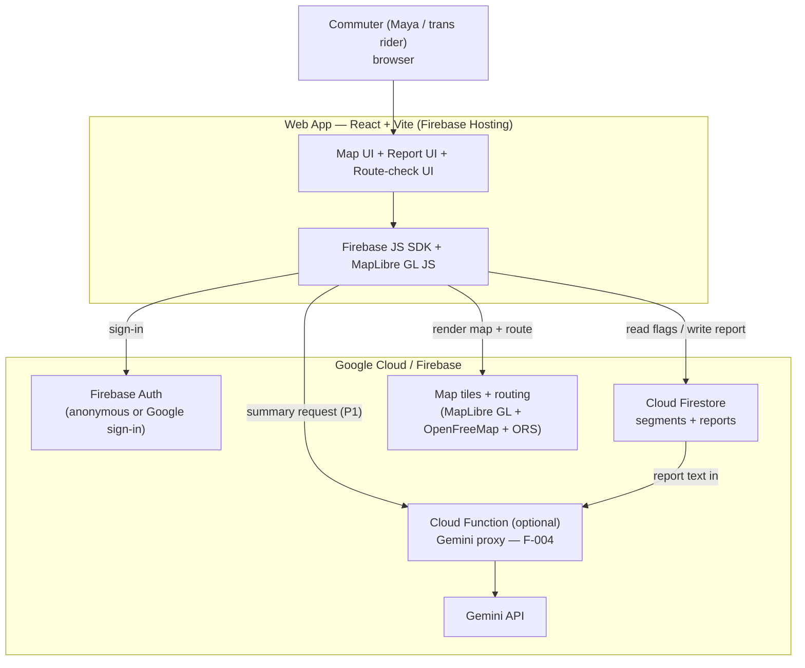

> ⚠️ PROVENANCE: Generated by FMD from idea.md (status: draft, schema 1.1.0). Build context: SparkFest MVP (elimination July 2). Maps/routing = MapLibre GL + OpenFreeMap + OpenRouteService (non-Google); Google-tech requirement met via Firebase + Gemini. Provisional pending post-July-2 validation. No facts fabricated.

# System Design Document (HLD)

> **Purpose:** the HOW, architecture. High-level. Produced by the `architect` subagent from the
> PRD. Each tech choice carries a trade-off.
> Traces back to: PRD (`docs/03-prd.md`), `idea.md`. Traces forward to: technical design, API spec, data model.
> **Build context:** 2-day SparkFest hackathon MVP. Web app + Firebase + MapLibre GL + OpenFreeMap (keyless) + OpenRouteService (ORS) + Gemini.
> Scope is deliberately narrow; F-004 (Gemini summary) is P1 stretch.

## Context diagram

The system is a single-page web app served from Firebase Hosting. It talks to Firebase surfaces —
Cloud Firestore (segment reports) and Gemini API (P1 risk summary) — plus keyless map rendering
via MapLibre GL + OpenFreeMap and point-to-point routing via OpenRouteService (ORS). The
Google-tech requirement is satisfied by Firebase + Gemini, not by the map stack. All actors are
commuters in the single PUP Sta. Mesa zone (BR-003).

**Resolved (2026-07-01):** the build uses MapLibre GL JS + OpenFreeMap vector tiles (free, no API
key) for rendering, and OpenRouteService (ORS) foot-walking directions for point-to-point routing
— not Google Maps Platform as originally planned here. See "Key technology choices" below and
`docs/superpowers/specs/2026-07-01-highway-aware-routing-design.md` for the routing behavior.

**Resolved (2026-07-01, later same day):** Gemini moved from a P1/optional summary feature to a
**critical-path moderation gate** — every report write now goes through the `submitReport` Cloud
Function, which is the only entity permitted to write to `reports` (Firestore Rules deny client
writes outright). Firebase Storage was added for photo evidence. The diagram above is not
redrawn pixel-for-pixel here; see the Components table and
`docs/superpowers/specs/2026-07-01-severity-tiered-ai-routing-design.md` for the current shape:
`Web App → submitReport (Cloud Function, Admin SDK) → Firestore`, `Web App → Storage` (photo
upload, auth-gated), `Web App → ORS` (multi-route, severity-tiered).

## Components & responsibilities

| Component | Responsibility | Owns | Depends on |
|-----------|----------------|------|------------|
| **Web app (React + Vite)** | Renders zone map, segment flags, report form, route-check result | UI state, client validation (condition-only fields, BR-001) | Firebase JS SDK, MapLibre GL + OpenFreeMap (keyless), ORS |
| **Firebase Auth** | Authenticate reporters (BR-005) | User identity / session token | — |
| **Cloud Firestore** | Store + serve segment reports with type + timestamp (BR-004); serve seed pins | Report documents, segment metadata | Written only by `submitReport` (Admin SDK) as of F-006 — see Security Rules |
| **Firestore Security Rules** | Authz gate: reads open; `reports` writes now denied entirely for clients (F-006) — enforcement moved to `submitReport`'s code | Access policy | Auth |
| **MapLibre GL + OpenFreeMap** | Map tiles, segment overlays (F-001) | Map render + geometry | None — OpenFreeMap is keyless |
| **Report heatmap layer (F-010)** | Client-side visualization of validated (yellow/red severity) reports as glowing lucide severity-icon markers | Rendering only — no data ownership | Cloud Firestore (`reports`, already-subscribed), segment `geo` (seed data), react-map-gl markers + lucide-react icons |
| **OpenRouteService (ORS)** | Severity-tiered, multi-route (2-3 alternatives) point-to-point routing (F-005) — red hard-avoid, yellow soft-avoid, green informational only | Route geometry | API key (ships in client bundle; not yet referrer-restricted — open item, see Security must-dos in `AGENTS.md`) |
| **Gemini API — `summarizeSegment`** | Dedup + structure free-text reports into a summary; adds no facts (BR-006) | Summary text only | Report data from Firestore |
| **Gemini API — `submitReport`** | **Critical path (F-006), not P1.** Classifies report severity, detects duplicates for corroboration-merge, rejects spam — blocking, fail-closed | The only path that writes a `reports` doc | Report submission data, recent reports on the segment |
| **Cloud Function (`backend/functions`)** | Server-side proxy holding the Gemini key; hosts `summarizeSegment`, `submitReport`, and `assessRoute` (F-003/F-008 — reads each on-route segment's report, returns a written safety verdict) | Gemini secret + prompts; sole writer of `reports` | Gemini API, Firestore (Admin SDK) |
| **Firebase Storage** | Report photo evidence (F-007) | Photo objects under `reports/{uid}/...` | Auth (via storage rules); `submitReport` validates the path ownership |
| **Storage Security Rules** | Authz gate: auth-gated write, size/type limits, public read | Access policy | Auth |

## Data flow

**UJ-001 — Pre-trip route check (F-003/F-001):**
1. App loads → MapLibre GL + OpenFreeMap (keyless) renders the Sta. Mesa zone → app reads current segment flags from Firestore.
2. User selects/enters a route through the zone.
3. App matches route to segments, computes per-segment status from flag type + freshness window (BR-004), and renders "okay" vs. "flagged tonight."
4. User decides: proceed / re-route / pay. (No SOS or dispatch anywhere — BR-002.)

**Map point-to-point routing (F-005, severity-tiered multi-route, superseding the 2026-07-01
single-route cascade):**
1. User sets Point A (defaults to zone center) and clicks a destination Point B on the map.
2. App fetches 1-3 ranked route candidates from ORS: "safest" (avoids both red-severity and
   yellow-severity zones, refined away from highway legs), "red-only" (avoids red only, may cross
   yellow), "unrestricted" — each fetched only when it could add a distinct alternative. Capped at
   4 ORS calls per request (up from 2) — see
   `docs/superpowers/specs/2026-07-01-severity-tiered-ai-routing-design.md` for the full cascade.
3. All candidates render green (never orange/caution) with opacity stepped by rank — the safest
   full-opacity, alternates progressively fainter — plus a per-route text badge naming the
   tradeoff (uses a major road / passes a caution area / passes a dangerous area / a dangerous
   area could not be avoided).
4. `RouteCheck.jsx` (F-003/F-008, bottom-center map overlay, collapsed to a toggle button by
   default) lets the user ask "Is my route okay tonight?" for the currently selected route.
   **Revised (2026-07-01, later same day):** the earlier rule-based `RouteSafetyPanel.jsx`
   (bottom-left, auto-running) is removed entirely. There is now one surface, on-demand only —
   tapping the button calls `assessRoute` (new Cloud Function) with the segments near the
   selected route (ID + name only, computed the same way `RouteSafetyPanel` used to via
   `nearestDistanceToRoute`); the Function reads each segment's real Firestore report itself and
   returns a short Gemini-written verdict, or a plain "looks okay" state with no Gemini call if
   nothing active was found along the route. `RiskSummary.jsx` (F-004) sits alongside it in the
   same bottom-center overlay, also collapsed to a toggle button by default. `HomePage.jsx`'s
   side-pane (and its static tagline copy) is removed entirely — `ZoneMap.jsx` is the only
   content on the page, and owns both the bottom-center overlay (`RouteCheck` + `RiskSummary`)
   and on-route marker visibility for low-concern reports (a purple/"green-severity" marker
   renders only when its segment sits within `YELLOW_AVOID_RADIUS_M` of the currently selected
   route — see `nearestDistanceToRoute`; with no route selected, none render).

**UJ-002 — Report + AI review (F-002/F-006/F-007, supersedes the original direct-write flow):**
1. User authenticates (BR-005); anonymous or Google sign-in.
2. User selects a segment, selects one condition flag {poor lighting, no crowd, recent incident}
   — no free-text crime label exists in the form (BR-001) — adds a required title + note,
   optionally a photo, then taps Submit.
3. Client EXIF-strips + uploads any photo to Storage (BR-008), then calls `submitReport`
   (blocking — the client shows a spinner). The Function validates the request, fetches recent
   reports on the segment, and calls Gemini for a structured `{severity, duplicateOfIndex,
   verdict}` decision (BR-007) — verdict is `valid`, `spam`, `mismatch` (title/note don't
   describe the selected condition), or `crime_label` (BR-001); any non-valid verdict rejects
   with canned copy. Fail-closed: any Gemini error rejects the report rather than writing it
   unmoderated.
4. Function acts: writes a new report doc (Admin SDK — the only path that can), or increments
   `corroborationCount`/`lastActivityAt` on an existing report (duplicate merge), or returns a
   rejection with nothing written. Map flag updates from the live Firestore read once a doc
   exists.

**UJ-003 — Read the risk picture (F-001/F-004):**
1. User views zone map with aggregated flags.
2. (P1) App requests a structured summary; Cloud Function reads the segment's reports, prompts Gemini to deduplicate + structure only the submitted content (BR-006), returns summary text.
3. App renders the summary alongside the map. If F-004 is cut for time, UJ-003 degrades to the raw flag list — still functional.

## Segment / report data shape (high level)

> Light only — full schema is the data-model doc's (`09`) job.

- **segment**: `{ segmentId, name, geo (point or polyline) }` — seeded from idea §7's 8 provisional pins, all `[unverified]` demo content (not evidence).
- **report**: `{ reportId, segmentId, conditionType (enum: poor_lighting | no_crowd | recent_incident), severity (enum: green | yellow | red, AI-assigned — F-006), corroborationCount, createdAt, lastActivityAt (timestamps), uid, title (required short free text, ≤60 chars, F-006-validated), note? (optional free text), photoPath? (optional Storage path — F-007) }`.
- Derived: a segment's "tonight" status = newest report (by `lastActivityAt || createdAt`) within the freshness window. **Freshness window value is `[unverified]`** — not specified in idea/PRD; a 24h constant is in place (`frontend/src/lib/freshness.js`), open for revisit.
- **Hard rule:** no field for neighborhood/crime classification anywhere in the schema (BR-001). Enum is closed; enforced in `submitReport`'s code (moved out of Security Rules as of F-006 — see `docs/09-data-model.md`). `severity` is a distinct, per-report triage field, not a variant of this prohibition (BR-007).
- **F-010 heatmap (client-side only, no schema/backend change):** `frontend/src/lib/heatmap.js` joins each report with `severity in {yellow, red}` to its segment's `geo` and collapses them to one marker per segment (worst severity wins; qualifying-report count kept, capped). `ReportHeatmap.jsx` renders each as a non-interactive map marker showing the lucide severity icon with a glow halo in the severity color, sized by the report count. Reuses the existing 24h freshness window (`freshness.js`) so the heatmap reflects current, not historical, conditions. No new Firestore query, index, or Cloud Function — it's a client-side reduction over the already-subscribed `reports` array.

## Key technology choices + rationale

| Choice | Why | Trade-off | Alternative rejected |
|--------|-----|-----------|----------------------|
| **React + Vite web app** | Fastest path to a demoable, public-repo, deployable artifact in 2 days; huge ecosystem for Maps/Firebase | Not a native mobile app (the real product is mobile-first) — acceptable for a demo | Flutter / React Native (longer setup, device/emulator friction in a hackathon) |
| **Firebase Hosting** | One-command deploy, HTTPS, integrates with Auth/Firestore | Vendor lock-in to Google — fine, and satisfies Google-tech requirement | Vercel/Netlify (adds a second vendor; loses tight Firebase coupling) |
| **Cloud Firestore** | Realtime reads make flags update live with zero polling code; serverless = no backend to stand up | Query/aggregation limits; cost at scale unmodeled (`[unverified]`) | A custom Node/Express + DB backend (too much to build + host in 2 days) |
| **Firebase Auth (anonymous by default, optional Google sign-in via account linking)** | Lightweight; satisfies BR-005 abuse-control gate with near-zero UI | Anonymous-only gives weak abuse control (no real accountability) until a user upgrades; Google sign-in adds friction but is opt-in via `/login`, not required | Full email/password (more UI, more time) |
| **MapLibre GL + OpenFreeMap (keyless) rendering; OpenRouteService (ORS) routing** | Keyless vector-tile map render + overlays for F-001/F-003; ORS foot-walking directions for F-005 | No render key required; ORS route-vs-segment matching is non-trivial | Google Maps Platform (needs billing + restricted key; no Google-tech credit needed here — Firebase + Gemini already satisfy it) |
| **Gemini API via Cloud Function** | Was an innovation hook for F-004 (P1); **now also the F-006 moderation gate (P0, critical path)** — function keeps the API key server-side for both | Adds a deploy unit + latency on every report submission (blocking UX — accepted tradeoff, see design doc); client-side call is faster to build but **leaks the key** | Client-side Gemini call (rejected for prod due to key exposure; acceptable ONLY as a throwaway demo fallback — flagged below) |
| **Firebase Storage for photo evidence (F-007)** | Ships with the already-installed `firebase` SDK; same project, same auth model as Firestore | New privacy surface (bystander faces, incidental metadata) beyond what was threat-modeled pre-F-007 — mitigated only partially (EXIF stripped; face privacy not mitigated, see security-compliance Threat T7) | Third-party image host (adds a vendor, loses the unified Firebase auth/rules model) |
| **Report writes moved server-side (F-006)** | Firestore Rules can't verify "went through AI review"; only a server-side write (Admin SDK, bypasses Rules) can guarantee every report was moderated | Rules no longer validate `reports` shape on create — that enforcement now lives entirely in `submitReport`'s code, a single point of failure if that code has a bug | Keep client writes + Rules-only validation (rejected — can't enforce AI review this way; a client could always skip calling the moderation function and write directly) |

## Integration points

- **MapLibre GL + OpenFreeMap (keyless) rendering** — MapLibre GL JS loaded in-browser; OpenFreeMap vector tiles need no API key. Failure mode: tile endpoint unreachable → blank map; mitigate with a clear error state and seeded static fallback.
- **OpenRouteService (ORS) routing** — called from the browser for point-to-point directions (F-005); ORS API key ships in the client bundle and is **not yet origin-restricted** (open item — restrict by referrer/origin + cap request volume). Failure mode: key invalid/quota exhausted → route candidates fail; mitigate with a clear error state.
- **Cloud Firestore** — Firebase JS SDK over HTTPS/WebSocket; offline cache available. Failure mode: rules misconfigured → either data leak or total write-block; mitigate by testing rules before demo. As of F-006, `reports` create is denied for all clients regardless of rules content — the only failure mode left is `submitReport` itself failing (fail-closed: no write happens, not an unmoderated one).
- **Gemini API — `summarizeSegment`** — called from a Cloud Function. Failure mode: quota/latency/empty input → UJ-003 falls back to raw flag list. BR-006 enforced via a constrained prompt.
- **Gemini API — `submitReport`** — called from the same Cloud Function, now on the critical path for every report. Failure mode: quota/latency/malformed response → **fail-closed**, the report is rejected outright (not written unmoderated, not falling back to a raw write). BR-007 enforced via a constrained classify prompt.
- **Firebase Storage** — Firebase JS SDK; client uploads directly (auth-gated by Storage rules), `submitReport` validates the resulting path belongs to the caller before attaching it to a report. Failure mode: upload fails → report submission proceeds without a photo (photo is optional) or the whole submit fails, depending on where in the flow the failure occurs — surfaced via `reportIntake.js`'s existing error path.

## Authentication & authorization (every network-exposed surface)

> This is a factory gate — stated explicitly for each surface.

1. **Cloud Firestore (read/write reports)** — Reads: open (flags are public safety info; no PII beyond uid). **Writes: denied for all clients (F-006)** — `allow create, update, delete: if false`. The only writer is `submitReport`, via the Admin SDK, which bypasses Rules entirely; that Function's own auth check (`request.auth != null`, BR-005) and validation code (closed enum, BR-001) are now the real gate, not Rules. Without rules at all, Firestore would still be write-blocked for clients (the `false` lines are explicit, not merely a default) but reads would need their own gate — rules remain mandatory.
2. **Firebase Auth** — the identity surface itself. Anonymous by default (demo speed), with an optional Google sign-in upgrade via account linking (`/login`) that preserves the `uid`. While still anonymous, weak abuse control is a documented limitation, unchanged by F-006 (the Function still trusts whatever `request.auth.uid` Firebase Auth hands it).
3. **Map key surface** — **Rendering (MapLibre GL + OpenFreeMap): no key at all** — OpenFreeMap tiles are keyless, so there is nothing to restrict or leak. **Routing (OpenRouteService): a client-side key** ships in the browser bundle and is **not yet origin-restricted** — the open security item is to restrict it by HTTP referrer/origin and cap request volume in the ORS dashboard.
4. **Gemini API key** — **must NOT ship in the client.** Held in a Cloud Function (server-side); invoked by the authenticated client for both `summarizeSegment` and, as of F-006, `submitReport` — the latter is now P0/critical-path, not a P1 stretch. Client-side Gemini calls expose the key and are only acceptable as a knowingly-throwaway demo fallback — flagged as a security tradeoff, not for any real deployment.
5. **Firebase Storage (report photos, F-007)** — **Authz via Storage Security Rules** (`backend/storage.rules`). Reads: open (same public-safety-info posture as reports). Writes: require `request.auth != null`, path-scoped to the caller's own `reports/{uid}/` prefix, `<5MB`, `image/(jpeg|png)` only. Without rules, Storage is world-writable — same mandatory-gate posture as Firestore Rules.

## Deployment topology

- **One environment** for the hackathon (demo/prod collapsed). `[unverified]` — no separate staging; acceptable for a 2-day build, called out as a risk for anything beyond demo.
- Web app → Firebase Hosting (global CDN, HTTPS).
- Firestore + Auth → managed Firebase project.
- Cloud Function (`backend/functions`, now P0 — hosts both `summarizeSegment` and `submitReport`) → same Firebase project, single region (`asia-southeast1`).
- Storage → same Firebase project, gated by `backend/storage.rules`.
- ORS + Gemini → external/Google-managed; consumed via key/function.

## Scaling strategy

N/A for the hackathon beyond defaults — **because** this is a single-zone (BR-003), single-environment demo. Firestore + Hosting + Functions autoscale on Google's managed infra with no work from us. Real scaling concerns are deferred and flagged:

- **Cold-start / contribution density** — the idea's single riskiest assumption (idea §9): the map is useless without enough fresh reports. This is a product/validation risk, not an infra one; no architecture fixes it. `[unverified]`
- **Cost at scale** — Firestore reads, ORS routing calls, and Gemini calls are all billable (MapLibre GL + OpenFreeMap rendering is free/keyless); **no cost model exists** (`[unverified]`, carried from PRD dependencies).
- **Non-functional requirements at risk (open questions — not invented):** no defined targets for availability, latency, freshness-window length, or report-volume ceilings. All `[unverified]` — must be set post-July 2, not guessed here.

## Trade-offs considered

- **Web vs. native mobile** — chose web for demo speed; the real product is a phone-in-hand commute tool, so this is a demo-only compromise. → Proposed ADR.
- **Gemini key: Cloud Function vs. client-side** — chose server-side function for key safety. **Updated (F-006):** this is no longer a P1-cut-safe risk — `submitReport` is now P0/critical-path, so the Function's uptime/latency directly gates F-002. → Proposed ADR.
- **Anonymous vs. Google auth** — decided: anonymous by default for speed (accepting weak abuse
  control until upgraded), with an optional Google sign-in upgrade via account linking so the uid
  persists. → Proposed ADR.
- **Single-environment deploy** — accepted no staging for a 2-day build; not safe beyond demo.
- **Report creation: client-direct-write vs. server-only-via-callable (F-006)** — **decided: server-only.** Firestore Rules can only inspect a write's shape, not whether it passed AI review, so client-direct-write + Rules-as-gate cannot enforce moderation (a client could always skip the review call). Moving creation into `submitReport` (Admin SDK, bypasses Rules) makes the Function the single, auditable enforcement point, at the cost of Rules no longer validating `reports` shape on create and a new single-point-of-failure surface (a bug in the Function's validation is no longer backstopped by Rules). → Proposed ADR.

### Proposed ADRs
- ADR: Web app (React + Vite) over native mobile for the hackathon MVP.
- ADR: Gemini API key held server-side in a Cloud Function (not client-side) — **now backing a P0 critical path (`submitReport`), not just the P1 `summarizeSegment`.**
- ADR: Firebase Auth method — anonymous by default, optional Google sign-in via account linking
  (decided, implemented at `/login`).
- ADR: Report writes moved server-side (`submitReport` via Admin SDK); `backend/firestore.rules` denies all client `create`/`update`/`delete` on `reports`.

## 2-day build sequence

Order to reach a working demo, P0 first, P1 last (cut-safe):

**Day 1 — core map + reporting (P0):**
1. Scaffold React + Vite app; init Firebase project (Auth + Firestore + Hosting); deploy a hello-world to Hosting to prove the pipeline.
2. Render the Sta. Mesa zone with MapLibre GL + OpenFreeMap (keyless — no map key to set or restrict); wire OpenRouteService (ORS) for routing and **restrict the ORS key by origin + cap request volume** as soon as it's added (F-001/F-005).
3. Seed Firestore with the 8 provisional segment pins (idea §7, `[unverified]` demo content); read + render flags on the map (F-001).
4. Wire Firebase Auth (anonymous) and **write + test Firestore Security Rules** (auth-to-write, closed enum, no crime field — BR-001/005). Don't demo writes until rules pass.
5. Build the one-tap report form (condition enum only) → write to Firestore → live flag update (F-002, UJ-002).

**Day 2 — route check, then stretch + polish:**
6. Build pre-trip route check: select a route, compute per-segment status from type + freshness (BR-004), show okay vs. flagged tonight (F-003, UJ-001). **Decide the freshness window here** (`[unverified]` — pick a value, document it).
7. Verify business rules end-to-end: no SOS/rescue copy (BR-002), single zone only (BR-003), condition-only data (BR-001).
8. **(P1 stretch) F-004:** Cloud Function → Gemini, constrained dedup/structure prompt (BR-006), render summary in UJ-003. If time runs short, skip — UJ-003 degrades to the raw flag list.
9. Polish demo path for the 3 P0 journeys; deploy final to Hosting; rehearse.

> Guardrail: keep auth/rules and key restriction in steps 2 and 4 — they are gates, not polish. A world-writable Firestore or an unrestricted ORS routing key is a demo-day liability.
